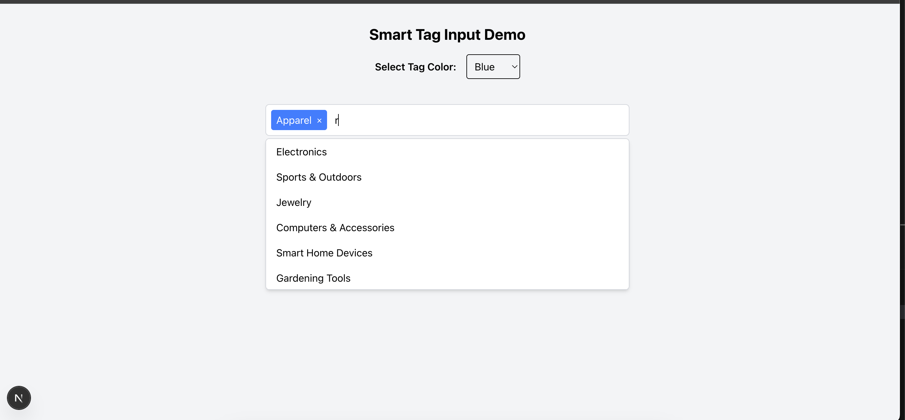

# Smart Tag Input with Dynamic Search

This project implements a reusable, accessible multi-select tag input component with dynamic suggestions. Built with **Next.js (App Router)**, **TypeScript**, **Tailwind CSS**, and tested using **Vitest** and **@testing-library/react**.

## ✨ Features

- Dynamic tag suggestions with async API call
- Keyboard navigation (↑, ↓, ⏎, Esc, Backspace)
- Tag selection and removal
- Customizable tag color via props
- Debounced search input
- Local cache to avoid redundant API calls
- Accessible & fully tested

## 📦 Tech Stack

- **Framework:** [Next.js App Router](https://nextjs.org/docs/app/building-your-application/routing)
- **Styling:** [Tailwind CSS](https://tailwindcss.com/)
- **Language:** TypeScript and javascript
- **Testing:** [Vitest](https://vitest.dev/), [Testing Library](https://testing-library.com/docs/react-testing-library/intro/)

---

## 📁 Project Structure

```
/src
  /components
    SmartTagInput/
      SmartTagInput.tsx
      Tag.tsx
      SuggestionsList.tsx
  /lib
    api.ts         # mocked API
/tests
  SmartTagInput.test.tsx
```

---

## 🚀 Getting Started

### 1. Clone the repo

```bash
git clone https://github.com/romeshyadav002/Smart-Tag-Input-with-Dynamic-Search.git
cd smart-tag-input
```

### 2. Install dependencies

```bash
npm install
# or
yarn install
```

### 3. Run the development server

```bash
npm run dev
# or
yarn dev
```

Open [http://localhost:3000](http://localhost:3000) in your browser.

---

## ✅ Running Tests

### Run all tests:

```bash
npm run test
# or
yarn test
```

### Commands included:

```jsonc
// package.json scripts
{
  "dev": "next dev",
  "build": "next build",
  "start": "next start",
  "test": "vitest run",
}
```

---

## 🧪 Test Coverage

The following test scenarios are covered:

- ✅ Renders the input field
- ✅ Fetches and displays suggestions on typing
- ✅ Selects a tag via click and keyboard
- ✅ Removes tags via "x" button and Backspace
- ✅ Handles empty results gracefully
- ✅ Esc key to clear suggestions
- ✅ Debounced API call + cached results

See [`TEST_PLAN.md`](./TEST_PLAN.md) for full details.

---

## 📘 Learn More

- [Next.js App Router](https://nextjs.org/docs/app)
- [Tailwind CSS](https://tailwindcss.com/docs)
- [Vitest](https://vitest.dev/)
- [React Testing Library](https://testing-library.com/docs/react-testing-library/intro/)
- [Debounce in React](https://usehooks.com/useDebounce/)

---

## 🔒 Security Note

Next.js handles:
- **Deferred script loading** automatically
- Protection against **Cross-Site Scripting (XSS)**

This improves the safety and performance of dynamic React applications by default.

---

## 📸 Screenshot




---

## 📄 License

Feel free to fork and customize this component!